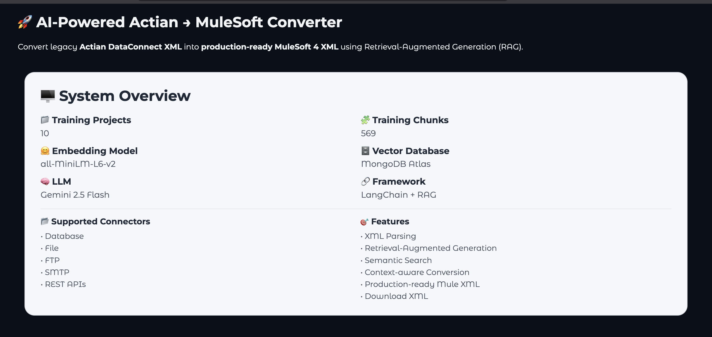
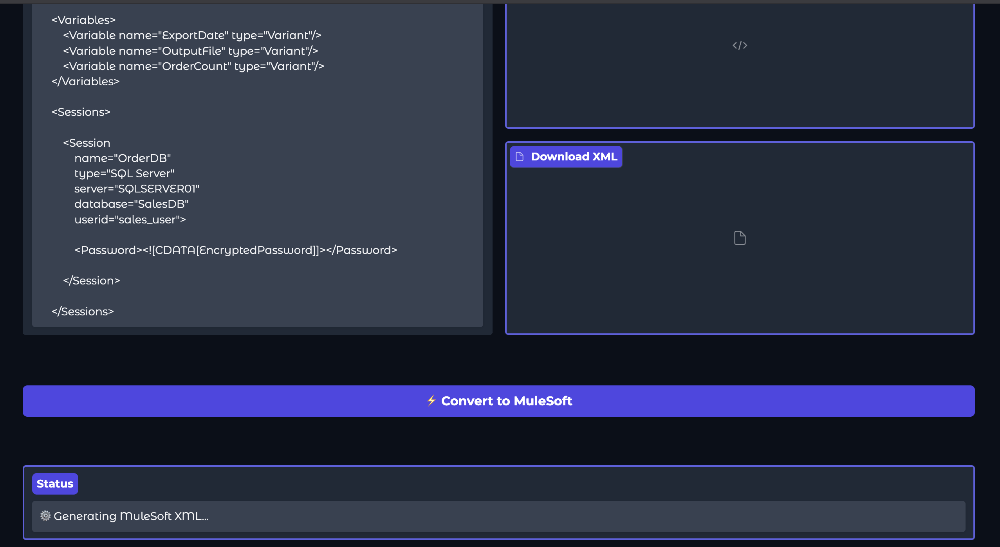
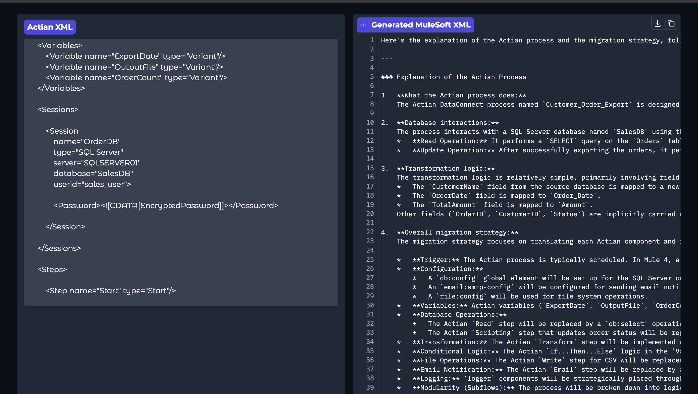
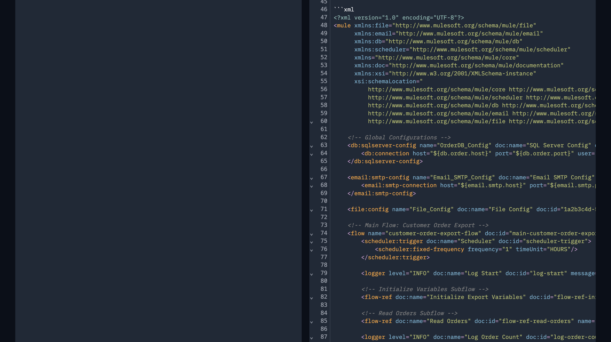
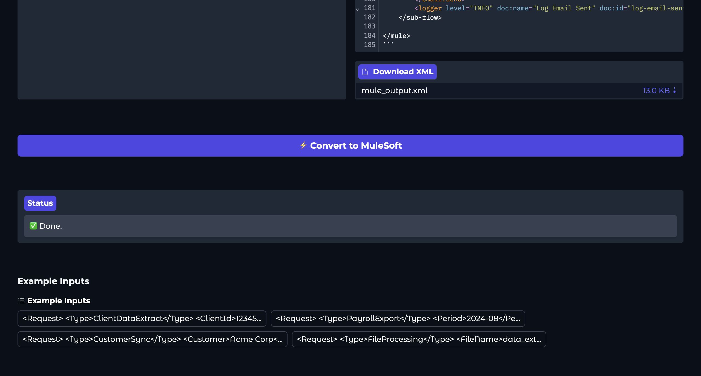

# 🚀 AI-Powered Actian → MuleSoft Converter

Convert legacy **Actian DataConnect XML** into **production-ready MuleSoft 4 XML** using **Retrieval-Augmented Generation (RAG)**, **MongoDB Atlas Vector Search**, **LangChain**, **Hugging Face Embeddings**, and **Google Gemini**.

This project demonstrates how Large Language Models can be combined with enterprise knowledge retrieval to automate legacy integration migrations.

---

## 📖 Overview

Migrating enterprise integrations from **Actian DataConnect** to **MuleSoft** is traditionally a manual and time-consuming process.

This application automates that migration by:

- Parsing Actian XML
- Retrieving similar historical Actian → MuleSoft conversions
- Using Retrieval-Augmented Generation (RAG)
- Generating production-ready MuleSoft 4 XML
- Providing a downloadable MuleSoft XML output

Instead of relying only on an LLM's knowledge, the system first retrieves relevant migration examples from a vector database, resulting in significantly more context-aware conversions.

---

# ✨ Features

- ✅ AI-powered Actian → MuleSoft XML conversion
- ✅ Retrieval-Augmented Generation (RAG)
- ✅ MongoDB Atlas Vector Search
- ✅ HuggingFace sentence-transformer embeddings
- ✅ Google Gemini integration
- ✅ LangChain orchestration
- ✅ Enterprise XML processing
- ✅ Context-aware migration using historical examples
- ✅ Download generated MuleSoft XML
- ✅ Interactive Gradio UI

---

# 🏗 Architecture

```
                  +-----------------------+
                  |  Actian XML Input     |
                  +-----------+-----------+
                              |
                              |
                     XML Parsing
                              |
                              ▼
                HuggingFace Embeddings
                              |
                              ▼
             MongoDB Atlas Vector Search
                              |
                 Retrieve Similar Examples
                              |
                              ▼
               Prompt Construction (RAG)
                              |
                              ▼
                Google Gemini LLM
                              |
                              ▼
             Production MuleSoft XML
                              |
                              ▼
                  Download XML Output
```

---

# 🧠 Tech Stack

| Category | Technology |
|----------|------------|
| Language | Python 3.12 |
| LLM | Google Gemini |
| Framework | LangChain |
| Embeddings | sentence-transformers/all-MiniLM-L6-v2 |
| Vector Database | MongoDB Atlas |
| UI | Gradio |
| Database Driver | PyMongo |
| XML Processing | Python |

---

# 📂 Project Structure

```
actian-to-mulesoft-rag/
│
├── app.py                     # Gradio UI
├── ingest.py                  # Builds Vector Database
├── rag_pipeline.py            # Retrieval + Generation
├── config.py                  # Configuration
├── requirements.txt
├── README.md
│
├── data/
│   ├── Project1/
│   ├── Project2/
│   └── ...
│
├── outputs/
│
├── screenshots/
│
└── .env.example
```

---

# ⚙️ How It Works

## Step 1

Training examples consist of paired:

- Actian XML
- MuleSoft XML

Example:

```
Project A

Actian XML
↓

Expected MuleSoft XML
```

---

## Step 2

The ingestion pipeline:

- Reads all project folders
- Chunks XML intelligently
- Generates semantic embeddings
- Stores vectors inside MongoDB Atlas

```
XML Files

↓

Chunking

↓

Embeddings

↓

MongoDB Atlas
```

---

## Step 3

When a new Actian XML is submitted:

```
User XML

↓

Embedding

↓

Similarity Search

↓

Retrieve Top Matching Examples

↓

Build Prompt

↓

Gemini

↓

Generate MuleSoft XML
```

---

# 🚀 Running the Project

## Clone Repository

```bash
git clone https://github.com/yourusername/actian-to-mulesoft-rag.git

cd actian-to-mulesoft-rag
```

---

## Install Dependencies

```bash
pip install -r requirements.txt
```

---

## Configure Environment

Create a `.env`

Example:

```env
MONGO_URI=your_mongodb_uri

DB_NAME=ragdb

COLLECTION_NAME=docs

INDEX_NAME=actian-mule-index

EMBEDDING_PROVIDER=huggingface

EMBEDDING_MODEL=sentence-transformers/all-MiniLM-L6-v2

LLM_PROVIDER=gemini

GEMINI_API_KEY=YOUR_GEMINI_KEY

CHAT_MODEL=gemini-2.5-flash
```

---

## Build Vector Database

```bash
python ingest.py
```

---

## Launch Application

```bash
python app.py
```

Open:

```
http://127.0.0.1:7860
```

---

# 📸 Screenshots

# 📸 Application Walkthrough

## 1️⃣ Overview

Shows the application dashboard and project information.



---

## 2️⃣ XML Generation

Shows XML input/output interface. Paste an Actian DataConnect XML file and click **Convert to MuleSoft**.



---

## 3️⃣ AI Migration Explanation

The application explains the migration strategy, business logic, database interactions, and transformation steps before generating the MuleSoft flow.



---

## 4️⃣ Generated MuleSoft XML

The generated production-ready MuleSoft XML is displayed with syntax highlighting and is available for download.



---

## 5️⃣ Completed Conversion

Final output with downloadable MuleSoft XML generated using Retrieval-Augmented Generation (RAG).



# 💡 Future Improvements

- LangGraph workflow orchestration
- Multi-file Actian project migration
- Streaming XML generation
- XML validation before generation
- Human feedback loop
- Batch conversion support
- Docker deployment
- Kubernetes deployment
- CI/CD pipeline
- Support for additional integration platforms

---

# 🎯 Skills Demonstrated

- Retrieval-Augmented Generation (RAG)
- Vector Search
- Semantic Search
- Prompt Engineering
- Enterprise AI Applications
- Google Gemini
- MongoDB Atlas
- LangChain
- Gradio
- Python
- XML Processing
- AI Workflow Design

---

> **Note**
>
> The original Actian and MuleSoft XML training dataset is not included because it contains enterprise integration examples. The application can be used with any paired Actian → MuleSoft XML examples following the same folder structure.

---

# 📜 License

This project is licensed under the MIT License.

---

# 👩‍💻 Author

**Yadvi Nanda**

AWS Certified Machine Learning Engineer – Associate

AI/ML Engineer | NLP | LLMs | RAG | Computer Vision | Agentic AI

---

⭐ If you found this project useful, consider giving it a star.